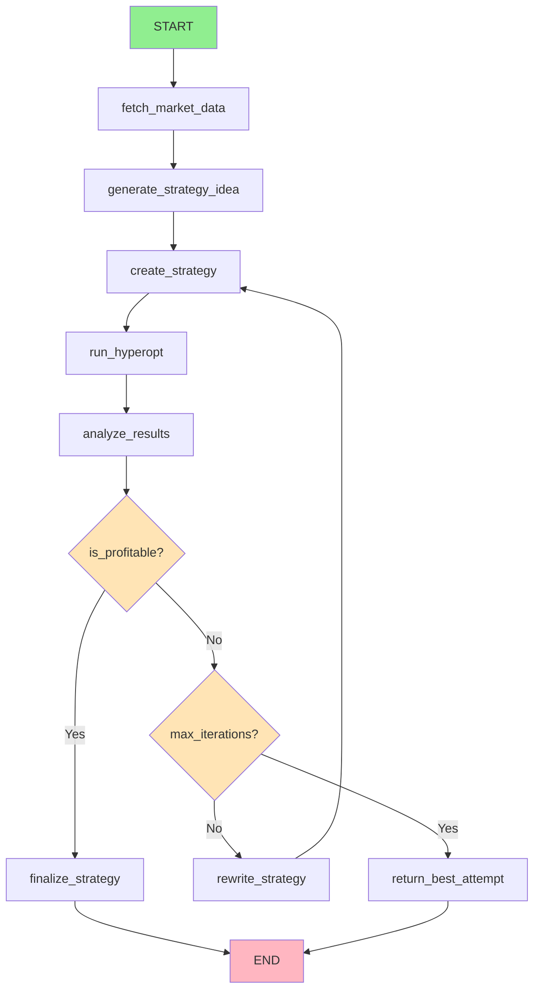

# Freqtrade Strategy Development Agent - LangGraph Architecture

## Overview
An autonomous agent that develops, optimizes, and validates trading strategies using the Freqtrade MCP server. The agent uses LangGraph for state management and workflow orchestration with Instructor for structured LLM interactions.

**Important**: This agent must be implemented inside the `freqtrade_mcp/` directory to ensure proper MCP server access to the freqtrade user_data directory and maintain security boundaries.

## Architecture Design

### Core Components

#### 1. State Schema
```python
class StrategyDevelopmentState(TypedDict):
    # Market Data
    symbols: List[str]  # ["BTC/USDT:USDT", "ETH/USDT:USDT", "SOL/USDT:USDT"]
    timeframes: List[str]  # ["1h", "4h"]
    candle_data: Dict[str, Dict[str, pd.DataFrame]]  # {symbol: {tf: data}}
    data_cached: bool
    
    # Strategy Development
    strategy_idea: str  # Generated idea description
    strategy_name: str
    strategy_code: str
    strategy_config: Dict
    
    # Optimization
    hyperopt_config: Dict
    hyperopt_results: Dict
    optimization_complete: bool
    
    # Analysis
    backtest_results: Dict
    performance_metrics: Dict
    is_profitable: bool
    analysis_summary: str
    
    # Iteration Control
    iteration_count: int
    max_iterations: int  # Default: 3
    final_strategy: Optional[Dict]
    
    # Error Handling
    errors: List[str]
    current_step: str
    retry_count: int
```

#### 2. Node Architecture



### 3. Node Functions

#### A. fetch_market_data
- **Purpose**: Retrieve and cache historical candle data
- **MCP Tools**: `fetch_candles`
- **Logic**:
  - Check if data exists in cache
  - Fetch 1 year of data for each symbol/timeframe
  - Store in state and local cache
  - Validate data completeness

#### B. generate_strategy_idea
- **Purpose**: Create trading strategy concept using market analysis
- **Instructor**: Single-shot prompt with market data context
- **Output**: Structured idea with indicators, logic, and rationale

#### C. create_strategy
- **Purpose**: Generate complete strategy code with hyperopt spaces
- **Instructor**: Chain of prompts (analyze idea → generate code → add hyperopt)
- **Output**: Python strategy file and configuration

#### D. run_hyperopt
- **Purpose**: Optimize strategy parameters
- **MCP Tools**: `run_hyperopt`
- **Logic**:
  - Configure optimization parameters
  - Execute hyperopt with progress monitoring
  - Extract best parameters and results

#### E. analyze_results
- **Purpose**: Evaluate strategy performance
- **MCP Tools**: `extract_backtest_data`, `extract_hyperopt_data`
- **Instructor**: Analysis prompt with results data
- **Output**: Performance assessment and recommendations

#### F. rewrite_strategy (Conditional)
- **Purpose**: Improve strategy based on analysis
- **Instructor**: Improvement prompt with failure analysis
- **Logic**:
  - Analyze failure patterns
  - Modify indicators/logic
  - Increment iteration counter

### 4. Conditional Edges

#### Performance Decision
```python
def should_continue_optimization(state: StrategyDevelopmentState) -> str:
    if state["is_profitable"]:
        return "finalize_strategy"
    elif state["iteration_count"] >= state["max_iterations"]:
        return "return_best_attempt"
    else:
        return "rewrite_strategy"
```

#### Error Handling
```python
def handle_errors(state: StrategyDevelopmentState) -> str:
    if state["errors"]:
        if state["retry_count"] < 3:
            return "retry_current_step"
        else:
            return "escalate_error"
    return "continue"
```

## Implementation Plan

### Phase 1: Core Infrastructure
1. **Setup LangGraph Environment**
   - Create agent directory: `freqtrade_mcp/strategy_agent/`
   - Install dependencies: `langgraph`, `instructor`, `pydantic`
   - Configure MCP client connection to local server
   - Setup logging and monitoring within MCP directory structure

2. **Define State Schema**
   - Create TypedDict classes
   - Add validation with Pydantic
   - Implement serialization for checkpointing

3. **Basic Graph Structure**
   - Create StateGraph instance
   - Add simple nodes (without full logic)
   - Define conditional edges
   - Test graph compilation

### Phase 2: Node Implementation
1. **Data Fetching Node**
   - Implement cache checking
   - MCP candle fetching with error handling
   - Data validation and storage

2. **Strategy Generation Nodes**
   - Instructor prompts for idea generation
   - Code generation with templates
   - Hyperopt space configuration

3. **Optimization & Analysis Nodes**
   - MCP hyperopt execution
   - Results extraction and parsing
   - Performance evaluation logic

### Phase 3: Advanced Features
1. **Error Recovery**
   - Retry mechanisms
   - Fallback strategies
   - Error logging and analysis

2. **Checkpointing**
   - State persistence between runs
   - Resume from failures
   - Progress tracking

3. **Monitoring & Observability**
   - Step timing and performance
   - Resource usage tracking
   - Strategy performance history

### Phase 4: Integration & Testing
1. **End-to-End Testing**
   - Test complete workflow
   - Validate all conditional paths
   - Performance benchmarking

2. **MCP Integration**
   - Ensure proper tool usage
   - Handle MCP server limitations
   - Optimize API calls

## Configuration

### Environment Variables
```bash
MCP_SERVER_URL=http://localhost:8000
CACHE_DIR=freqtrade_mcp/strategy_agent/cache
FREQTRADE_USER_DATA=../user_data  # Relative path from freqtrade_mcp/
MAX_ITERATIONS=3
HYPEROPT_EPOCHS=100
MIN_PROFIT_THRESHOLD=5.0  # 5% minimum profit
```

### Strategy Templates
- **Trend Following**: EMA + ADX + RSI
- **Mean Reversion**: Bollinger Bands + RSI + MACD
- **Momentum**: Stochastic + CCI + Volume
- **Hybrid**: Multi-indicator combinations

### Performance Criteria
- **Profitable**: Total return > MIN_PROFIT_THRESHOLD
- **Sharpe Ratio**: > 1.0
- **Max Drawdown**: < 20%
- **Win Rate**: > 40%

## Directory Structure
```
freqtrade_mcp/
├── strategy_agent/
│   ├── __init__.py
│   ├── agent.py              # Main LangGraph agent
│   ├── state.py              # State schema definitions
│   ├── nodes/                # Individual node implementations
│   │   ├── __init__.py
│   │   ├── data_fetcher.py
│   │   ├── strategy_generator.py
│   │   ├── hyperopt_runner.py
│   │   └── result_analyzer.py
│   ├── prompts/              # Instructor prompt templates
│   │   ├── __init__.py
│   │   ├── idea_generation.py
│   │   ├── strategy_creation.py
│   │   └── analysis.py
│   ├── cache/                # Local data cache
│   └── config.py             # Agent configuration
└── examples/
    └── run_strategy_agent.py  # Usage example
```

## Usage Example

```python
# freqtrade_mcp/examples/run_strategy_agent.py
import sys
sys.path.append('..')

from strategy_agent import StrategyDevelopmentAgent

agent = StrategyDevelopmentAgent(
    mcp_url="http://localhost:8000",
    freqtrade_data_dir="../user_data",
    symbols=["BTC/USDT:USDT", "ETH/USDT:USDT", "SOL/USDT:USDT"],
    timeframes=["1h", "4h"],
    max_iterations=3
)

result = await agent.develop_strategy()

if result["success"]:
    print(f"Strategy: {result['strategy_name']}")
    print(f"Profit: {result['metrics']['total_profit']}%")
    print(f"Sharpe: {result['metrics']['sharpe_ratio']}")
    print(f"Strategy saved to: ../user_data/strategies/{result['strategy_name']}.py")
else:
    print(f"Failed after {result['iterations']} attempts")
    print(f"Best attempt: {result['best_metrics']}")
```

## Success Metrics
- **Development Speed**: < 30 minutes end-to-end
- **Success Rate**: > 60% profitable strategies
- **Resource Efficiency**: < 2GB RAM usage
- **Reproducibility**: Deterministic results with same inputs

## Risk Management
- **Capital Limits**: Test with small amounts only
- **Time Limits**: Max 1 hour per hyperopt
- **Iteration Limits**: Max 3 strategy rewrites
- **Validation**: Always backtest before live deployment

## Future Enhancements
1. **Multi-Asset Strategies**: Portfolio optimization
2. **Live Trading Integration**: Paper trading validation
3. **Strategy Library**: Reusable components
4. **Performance Tracking**: Long-term monitoring
5. **Human-in-the-Loop**: Manual approval gates