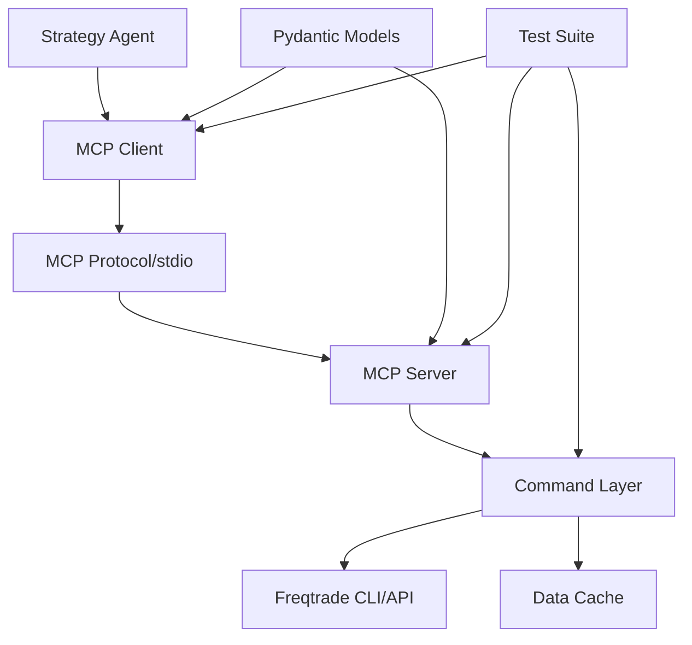
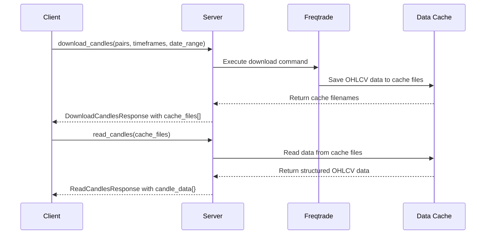

# Freqtrade MCP: Comprehensive Developer Guide

## Table of Contents
1. [Overview](#overview)
2. [Architecture](#architecture)
3. [Data Schema & Models](#data-schema--models)
4. [MCP Server](#mcp-server)
5. [MCP Client](#mcp-client)
6. [Command Implementation](#command-implementation)
7. [Testing Framework](#testing-framework)
8. [Development Workflow](#development-workflow)
9. [API Reference](#api-reference)
10. [Troubleshooting](#troubleshooting)

## Overview

**Freqtrade MCP** is a Model Context Protocol (MCP) implementation that provides programmatic access to Freqtrade trading operations. The system consists of a server exposing trading tools via MCP protocol and a client for seamless integration with strategy development workflows.

### Key Features

- **🔧 Modular Architecture**: Strict separation of concerns with command pattern
- **📋 Schema Validation**: Comprehensive Pydantic models for type safety
- **🔄 Async Operations**: Full async/await support for high performance
- **📊 Data Management**: Efficient cache-based data handling with standardized naming
- **🧪 Test Coverage**: Comprehensive unit and integration test suite
- **📝 Structured Logging**: MCP-integrated logging with structured output
- **⚡ Performance Optimized**: Two-step data access (download→read) for memory efficiency

### System Components



## Architecture

### Component Relationships

1. **MCP Server** (`src/server.py`): Exposes trading tools via MCP protocol
2. **Command Layer** (`src/commands/`): Implements business logic for each tool
3. **MCP Client** (`strategy_agent/mcp_client.py`): Provides programmatic access
4. **Data Models** (`src/models/`): Ensures schema consistency and validation
5. **Configuration** (`src/config.py`): Manages environment and runtime settings

### Design Patterns

#### Command Pattern
```python
class BaseCommand:
    """Abstract base for all MCP commands."""
    
    async def execute(self, **kwargs) -> Dict[str, Any]:
        """Execute command with validated inputs and structured output."""
        raise NotImplementedError
    
    async def mcp_log(self, level: str, message: str):
        """Log to MCP client with structured format."""
        pass
```

#### Factory Pattern
```python
class FreqtradeMCPServer:
    def __init__(self, config: Config):
        self.commands = {
            'download_candles': DownloadCandlesCommand(config, self),
            'read_candles': ReadCandlesCommand(config, self),
            # Additional commands...
        }
```

#### Repository Pattern
```python
# Cache-based data access pattern
# 1. Download → Generate cache files with standardized names
# 2. Read → Access specific data from cache files
# 3. Process → Transform data for analysis
```

## Data Schema & Models

### Core Pydantic Models

#### MCPBaseResponse
```python
class MCPBaseResponse(BaseModel):
    """Base response for all MCP operations."""
    command: str = Field(..., description="MCP command executed")
    success: bool = Field(..., description="Operation success status")
    error: Optional[str] = Field(None, description="Error message if failed")
    duration_seconds: Optional[float] = Field(None, description="Execution time")
    
    class Config:
        extra = "forbid"  # Strict schema enforcement
```

#### CacheFileInfo
```python
class CacheFileInfo(BaseModel):
    """Information about cached data files."""
    pair: str = Field(..., description="Trading pair symbol")
    filename: str = Field(..., description="Cache filename")
    full_path: str = Field(..., description="Absolute file path")
    candle_count: int = Field(default=0, description="Number of candles")
    
    class Config:
        extra = "forbid"
```

#### CandleData
```python
class CandleData(BaseModel):
    """Structured candle data with metadata."""
    symbol: str = Field(..., description="Trading pair symbol")
    timeframe: str = Field(..., description="Candle timeframe")
    data: Dict[str, Dict[str, float]] = Field(..., description="OHLCV data structure")
    candle_count: int = Field(default=0, description="Number of candles")
    
    class Config:
        extra = "forbid"
```

### Data Flow Schema



### Cache File Naming Convention

**Format**: `{symbol}-{timeframe}-{daterange}.json`

**Examples**:
- `BTC_USDT_USDT-1h-20240101-20250101.json` (Futures)
- `ETH_USDT-5m-20240101-20240201.json` (Spot)
- `BNB_BUSD_BUSD-4h-20240101-20240131.json` (Futures BUSD)

**Parsing Logic**:
```python
def parse_filename(filename: str) -> Tuple[str, str, str]:
    """Parse cache filename into components."""
    parts = filename.replace('.json', '').split('-')
    symbol_part = parts[0]
    timeframe = parts[1]
    daterange = '-'.join(parts[2:])
    
    # Convert symbol format: BTC_USDT_USDT → BTC/USDT:USDT
    if '_' in symbol_part:
        symbol_parts = symbol_part.split('_')
        if len(symbol_parts) == 3:  # Futures
            symbol = f"{symbol_parts[0]}/{symbol_parts[1]}:{symbol_parts[2]}"
        else:  # Spot
            symbol = '/'.join(symbol_parts)
    
    return symbol, timeframe, daterange
```

## MCP Server

### Server Implementation

```python
class FreqtradeMCPServer:
    """MCP server exposing Freqtrade operations."""
    
    def __init__(self, config: Config):
        self.config = config
        self.server = stdio_server()
        self.commands = self._initialize_commands()
        self._register_tools()
    
    def _initialize_commands(self) -> Dict[str, BaseCommand]:
        """Initialize all available commands."""
        return {
            'download_candles': DownloadCandlesCommand(self.config, self),
            'read_candles': ReadCandlesCommand(self.config, self),
            # Additional commands...
        }
    
    @self.server.tool()
    async def download_candles(
        self,
        pairs: Union[List[str], str],
        timeframes: Union[List[str], str], 
        date_range: str,
        exchange: str = None
    ) -> str:
        """Download historical candle data and return cache filenames."""
        try:
            result = await self.commands['download_candles'].execute(
                pairs=pairs,
                timeframes=timeframes,
                date_range=date_range,
                exchange=exchange
            )
            return json.dumps(result)
        except Exception as e:
            error_response = create_error_response("download_candles", str(e))
            return json.dumps(error_response.dict())
```

### Tool Registration

Tools are automatically registered with type hints for MCP protocol:

```python
@server.tool()
async def read_candles(
    self,
    cache_files: Union[List[str], str]
) -> str:
    """
    Read candle data from cache files.
    
    Args:
        cache_files: List of cache filenames or single filename to read
        
    Returns:
        JSON string with structured candle data
    """
```

### Error Handling

```python
async def tool_wrapper(self, tool_name: str, **kwargs) -> str:
    """Common wrapper for all tools with consistent error handling."""
    try:
        result = await self.commands[tool_name].execute(**kwargs)
        return json.dumps(result)
    except ValidationError as e:
        await self.send_log_message(LoggingLevel.ERROR, f"Validation error: {e}")
        error_response = create_error_response(tool_name, f"Validation error: {e}")
        return json.dumps(error_response.dict())
    except Exception as e:
        await self.send_log_message(LoggingLevel.ERROR, f"Unexpected error: {e}")
        error_response = create_error_response(tool_name, str(e))
        return json.dumps(error_response.dict())
```

## MCP Client

### Client Implementation

```python
class FreqtradeMCPClient:
    """Client for communicating with Freqtrade MCP Server."""
    
    def __init__(self, server_path: Optional[str] = None):
        self.server_path = server_path
        self.client = self._initialize_client()
    
    async def download_candles(
        self,
        pairs: Union[List[str], str],
        timeframes: Union[List[str], str],
        date_range: str,
        exchange: Optional[str] = None,
        validate_response: bool = False
    ) -> Union[Dict[str, Any], DownloadCandlesResponse]:
        """Download candles and optionally validate response."""
        response = await self.call_tool("download_candles", {
            "pairs": pairs,
            "timeframes": timeframes,
            "date_range": date_range,
            "exchange": exchange
        })
        
        if validate_response:
            return DownloadCandlesResponse(**response)
        return response
    
    async def call_tool(self, tool_name: str, arguments: Dict[str, Any]) -> Dict[str, Any]:
        """Call MCP tool with error handling."""
        try:
            if not self.client:
                return self._create_error_response("MCP client not initialized")
            
            response = await self.client.call_tool(tool_name, arguments)
            
            if not response.content:
                return self._create_error_response("No response content received")
            
            return json.loads(response.content[0].text)
            
        except Exception as e:
            return self._create_error_response(f"MCP call failed: {str(e)}")
```

### Response Validation

```python
# Client-side validation using Pydantic models
async def validated_download_candles(
    self, 
    **kwargs
) -> DownloadCandlesResponse:
    """Download candles with automatic response validation."""
    raw_response = await self.download_candles(**kwargs)
    
    try:
        return DownloadCandlesResponse(**raw_response)
    except ValidationError as e:
        logger.error(f"Response validation failed: {e}")
        raise ValueError(f"Invalid server response format: {e}")
```

## Command Implementation

### Base Command Pattern

```python
class BaseCommand(ABC):
    """Abstract base class for all MCP commands."""
    
    def __init__(self, config: Config, server: Optional[Any] = None):
        self.config = config
        self.server = server
    
    @abstractmethod
    async def execute(self, **kwargs) -> Dict[str, Any]:
        """Execute the command with given parameters."""
        pass
    
    async def mcp_log(self, level: str, message: str):
        """Send log message via MCP protocol."""
        if self.server:
            try:
                from mcp.types import LoggingLevel
                log_level = getattr(LoggingLevel, level.upper(), LoggingLevel.INFO)
                await self.server.send_log_message(log_level, message)
            except Exception as e:
                logger.warning(f"Failed to send MCP log: {e}")
```

### Download Candles Command

```python
class DownloadCandlesCommand(BaseCommand):
    """Command to download historical candle data."""
    
    async def execute(
        self,
        pairs: Union[List[str], str],
        timeframes: Union[List[str], str],
        date_range: str,
        exchange: str = None,
        **kwargs
    ) -> Dict[str, Any]:
        """
        Execute download candles command.
        
        Returns:
            DownloadCandlesResponse with cache file information
        """
        start_time = asyncio.get_event_loop().time()
        
        try:
            # Process parameters
            pairs_list = await self._process_pairs(pairs, exchange)
            timeframes_list = self._process_timeframes(timeframes)
            timerange = parse_and_format_date(date_range)
            
            # Execute downloads
            results = []
            for timeframe in timeframes_list:
                result = await self._download_for_timeframe(
                    pairs_list, timeframe, timerange, exchange
                )
                results.append(result)
            
            # Collect results
            all_cache_files = []
            total_candles = 0
            
            for result in results:
                if result.get("success"):
                    all_cache_files.extend(result.get("cache_files", []))
                    total_candles += result.get("candle_count", 0)
            
            # Create response
            duration = asyncio.get_event_loop().time() - start_time
            
            return DownloadCandlesResponse(
                command="download_candles",
                success=all(r.get("success", False) for r in results),
                pairs=pairs_list,
                timeframes=timeframes_list,
                cache_files=all_cache_files,
                total_candles=total_candles,
                duration_seconds=duration
            ).dict()
            
        except Exception as e:
            duration = asyncio.get_event_loop().time() - start_time
            return create_error_response(
                "download_candles", str(e), duration
            ).dict()
```

### Read Candles Command

```python
class ReadCandlesCommand(BaseCommand):
    """Command to read candle data from cache files."""
    
    async def execute(
        self,
        cache_files: Union[List[str], str],
        **kwargs
    ) -> Dict[str, Any]:
        """
        Read candle data from cache files.
        
        Returns:
            ReadCandlesResponse with structured candle data
        """
        start_time = asyncio.get_event_loop().time()
        
        try:
            if isinstance(cache_files, str):
                cache_files = [cache_files]
            
            candle_data = {}
            files_read = 0
            total_candles = 0
            
            for cache_file in cache_files:
                try:
                    # Determine file path
                    file_path = self._resolve_file_path(cache_file)
                    
                    if not file_path.exists():
                        await self.mcp_log("warning", f"Cache file not found: {file_path}")
                        continue
                    
                    # Parse filename for metadata
                    symbol, timeframe, timerange = self._parse_cache_filename(cache_file)
                    
                    # Read and process data
                    with open(file_path, 'r') as f:
                        raw_data = json.load(f)
                    
                    # Convert to structured format
                    structured_data, candle_count = self._convert_ohlcv_data(raw_data)
                    
                    # Store result
                    if symbol not in candle_data:
                        candle_data[symbol] = {}
                    
                    candle_data[symbol][timeframe] = CandleData(
                        symbol=symbol,
                        timeframe=timeframe,
                        data=structured_data,
                        candle_count=candle_count
                    ).dict()
                    
                    total_candles += candle_count
                    files_read += 1
                    
                    await self.mcp_log("info", f"Read {candle_count} candles from {cache_file}")
                    
                except Exception as e:
                    await self.mcp_log("error", f"Failed to read {cache_file}: {e}")
            
            # Create response
            duration = asyncio.get_event_loop().time() - start_time
            success = files_read > 0
            
            return ReadCandlesResponse(
                command="read_candles",
                success=success,
                files_requested=len(cache_files),
                files_read=files_read,
                candle_data=candle_data,
                total_candles=total_candles,
                duration_seconds=duration,
                error=None if success else f"Failed to read {len(cache_files) - files_read} of {len(cache_files)} files"
            ).dict()
            
        except Exception as e:
            duration = asyncio.get_event_loop().time() - start_time
            return create_error_response(
                "read_candles", str(e), duration
            ).dict()
```

## Testing Framework

### Test Structure

```
tests/
├── conftest.py              # Shared fixtures and configuration
├── unit/                    # Unit tests for individual components
│   ├── test_base_models.py  # Pydantic model validation
│   ├── test_commands.py     # Command execution logic
│   └── test_mcp_server.py   # Server functionality
├── integration/             # End-to-end workflow tests
│   └── test_mcp_flow.py     # Complete client-server flows
└── README.md               # Testing documentation
```

### Key Test Patterns

#### Model Validation Testing
```python
@pytest.mark.parametrize("invalid_data", [
    {"command": "test"},  # Missing required 'success' field
    {"success": True},    # Missing required 'command' field
    {"command": "test", "success": True, "extra": "field"}  # Extra field forbidden
])
def test_model_validation_failures(invalid_data):
    """Test that Pydantic models reject invalid data."""
    with pytest.raises(ValidationError):
        MCPBaseResponse(**invalid_data)
```

#### Command Execution Testing
```python
@pytest.mark.asyncio
async def test_download_candles_success(mock_config, sample_pairs):
    """Test successful download candles execution."""
    command = DownloadCandlesCommand(mock_config)
    
    with patch.object(command, '_download_for_timeframe') as mock_download:
        mock_download.return_value = {
            "success": True,
            "cache_files": [{"filename": "test.json", "candle_count": 100}]
        }
        
        result = await command.execute(
            pairs=sample_pairs,
            timeframes=["1h"],
            date_range="last month"
        )
        
        assert result["success"] is True
        assert result["command"] == "download_candles"
        assert len(result["cache_files"]) > 0
```

#### Integration Testing
```python
@pytest.mark.asyncio
async def test_download_read_integration(mcp_server, temp_data_dir):
    """Test complete download→read workflow."""
    # Setup test data
    cache_file = temp_data_dir / "BTC_USDT-1h-20240101-20240201.json"
    with open(cache_file, 'w') as f:
        json.dump(sample_ohlcv_data, f)
    
    # Test download (mocked to return cache filename)
    download_result = await mcp_server.download_candles(
        pairs="BTC/USDT",
        timeframes="1h",
        date_range="last month"
    )
    
    # Test read (actual file read)
    read_result = await mcp_server.read_candles(
        cache_files=[cache_file.name]
    )
    
    # Verify complete workflow
    download_data = json.loads(download_result)
    read_data = json.loads(read_result)
    
    assert download_data["success"] is True
    assert read_data["success"] is True
    assert "BTC/USDT" in read_data["candle_data"]
```

## Development Workflow

### Adding New Commands

1. **Create Command Class**
```python
# src/commands/new_command.py
class NewCommand(BaseCommand):
    async def execute(self, param1: str, param2: int = 10, **kwargs) -> Dict[str, Any]:
        # Implementation
        pass
```

2. **Create Response Model**
```python
# src/models/base_models.py
class NewCommandResponse(MCPBaseResponse):
    param1_result: str = Field(..., description="Result of param1 processing")
    param2_value: int = Field(..., description="Processed param2 value")
    
    class Config:
        extra = "forbid"
```

3. **Register in Server**
```python
# src/server.py
def _initialize_commands(self):
    return {
        # ... existing commands
        'new_command': NewCommand(self.config, self)
    }

@self.server.tool()
async def new_command(self, param1: str, param2: int = 10) -> str:
    """Description of new command."""
    result = await self.commands['new_command'].execute(
        param1=param1, param2=param2
    )
    return json.dumps(result)
```

4. **Add Client Method**
```python
# strategy_agent/mcp_client.py
async def new_command(
    self, 
    param1: str, 
    param2: int = 10,
    validate_response: bool = False
) -> Union[Dict[str, Any], NewCommandResponse]:
    """Call new command with optional validation."""
    response = await self.call_tool("new_command", {
        "param1": param1,
        "param2": param2
    })
    
    if validate_response:
        return NewCommandResponse(**response)
    return response
```

5. **Create Tests**
```python
# tests/unit/test_new_command.py
class TestNewCommand:
    @pytest.mark.asyncio
    async def test_execute_success(self, mock_config):
        command = NewCommand(mock_config)
        result = await command.execute(param1="test", param2=20)
        
        assert result["success"] is True
        assert result["param1_result"] == "processed_test"
        assert result["param2_value"] == 20
```

### Schema Evolution

When updating Pydantic models:

1. **Add new optional fields** (backward compatible)
```python
class ExistingModel(BaseModel):
    existing_field: str
    new_field: Optional[str] = Field(None, description="New optional field")
```

2. **Create new model versions** (breaking changes)
```python
class ExistingModelV2(BaseModel):
    # New required field or changed field types
    existing_field: int  # Changed from str to int
    new_required_field: str = Field(..., description="New required field")
```

3. **Update command responses gradually**
```python
# Phase 1: Support both old and new
if use_new_format:
    return NewModelResponse(**data).dict()
else:
    return OldModelResponse(**data).dict()

# Phase 2: Switch to new format only
return NewModelResponse(**data).dict()
```

## API Reference

### MCP Tools

#### download_candles
Download historical candle data and return cache filenames.

**Parameters:**
- `pairs` (str | List[str]): Trading pairs or "top15" for market cap selection
- `timeframes` (str | List[str]): Timeframes or "all" for standard set
- `date_range` (str): Natural language date range (e.g., "last month", "2024-01-01 to 2024-02-01")
- `exchange` (str, optional): Exchange name (defaults to config default)

**Returns:**
```json
{
  "command": "download_candles",
  "success": true,
  "pairs": ["BTC/USDT:USDT", "ETH/USDT:USDT"],
  "timeframes": ["1h"],
  "cache_files": [
    {
      "pair": "BTC/USDT:USDT",
      "filename": "BTC_USDT_USDT-1h-20240101-20250101.json",
      "full_path": "/data/BTC_USDT_USDT-1h-20240101-20250101.json",
      "candle_count": 8760
    }
  ],
  "total_candles": 8760,
  "duration_seconds": 45.2
}
```

#### read_candles
Read candle data from cache files.

**Parameters:**
- `cache_files` (str | List[str]): Cache filenames to read

**Returns:**
```json
{
  "command": "read_candles", 
  "success": true,
  "files_requested": 1,
  "files_read": 1,
  "candle_data": {
    "BTC/USDT:USDT": {
      "1h": {
        "symbol": "BTC/USDT:USDT",
        "timeframe": "1h",
        "data": {
          "open": {"0": 50000.0, "1": 50100.0},
          "high": {"0": 50500.0, "1": 50600.0},
          "low": {"0": 49500.0, "1": 49600.0},
          "close": {"0": 50100.0, "1": 50200.0},
          "volume": {"0": 1000.0, "1": 1100.0},
          "timestamp": {"0": 1704067200000, "1": 1704070800000}
        },
        "candle_count": 2
      }
    }
  },
  "total_candles": 2,
  "duration_seconds": 0.1
}
```

### Client Methods

#### FreqtradeMCPClient

```python
# Initialize client
client = FreqtradeMCPClient()

# Download candles
response = await client.download_candles(
    pairs=["BTC/USDT:USDT", "ETH/USDT:USDT"],
    timeframes=["1h", "4h"],
    date_range="last 3 months",
    exchange="binance"
)

# Read candles with validation
candle_response = await client.read_candles(
    cache_files=response["cache_files"],
    validate_response=True  # Returns ReadCandlesResponse object
)

# Access structured data
for symbol, timeframes in candle_response.candle_data.items():
    for tf, candle_data in timeframes.items():
        print(f"{symbol} {tf}: {candle_data.candle_count} candles")
```

## Troubleshooting

### Common Issues

#### 1. Import Errors
```
ImportError: attempted relative import beyond top-level package
```
**Solution**: Ensure proper Python path setup and use absolute imports.

#### 2. Schema Validation Errors
```
ValidationError: extra fields not permitted
```
**Solution**: Check for extra fields in data or update model with `extra = "allow"` temporarily.

#### 3. MCP Connection Issues
```
MCP client not initialized
```
**Solution**: Verify MCP server is running and stdio communication is established.

#### 4. File Not Found Errors
```
Cache file not found: /data/file.json
```
**Solution**: Check data directory configuration and cache file naming.

### Debugging Tips

#### Enable Verbose Logging
```python
import logging
logging.basicConfig(level=logging.DEBUG)

# For MCP-specific logs
logger = logging.getLogger("strategy_agent.mcp_client")
logger.setLevel(logging.DEBUG)
```

#### Validate Schema Manually
```python
from src.models.base_models import ReadCandlesResponse
try:
    response = ReadCandlesResponse(**data)
    print("✅ Schema validation passed")
except ValidationError as e:
    print(f"❌ Schema validation failed: {e}")
```

#### Test Individual Commands
```python
from src.commands.download_candles import DownloadCandlesCommand
from src.config import Config

config = Config()
command = DownloadCandlesCommand(config)

result = await command.execute(
    pairs=["BTC/USDT"],
    timeframes=["1h"],
    date_range="last week"
)
print(json.dumps(result, indent=2))
```

### Performance Optimization

#### Memory Usage
- Use cache files instead of loading all data into memory
- Process data in chunks for large datasets
- Clean up temporary files after processing

#### Network Efficiency
- Batch multiple symbol downloads
- Use appropriate timeframes to minimize API calls
- Implement caching for frequently accessed data

#### Async Best Practices
```python
# Good: Process multiple pairs concurrently
async def download_multiple_pairs(pairs):
    tasks = [download_single_pair(pair) for pair in pairs]
    results = await asyncio.gather(*tasks, return_exceptions=True)
    return results

# Bad: Process pairs sequentially
async def download_multiple_pairs_bad(pairs):
    results = []
    for pair in pairs:
        result = await download_single_pair(pair)  # Blocks other operations
        results.append(result)
    return results
```

### Migration Guide

#### From Dictionary Returns to Pydantic Models

**Before:**
```python
def process_data():
    return {
        "success": True,
        "data": some_data,
        "count": len(some_data)
    }
```

**After:**
```python
def process_data() -> ProcessResponse:
    response = ProcessResponse(
        command="process_data",
        success=True,
        data=some_data,
        count=len(some_data)
    )
    return response.dict()
```

#### From Sync to Async

**Before:**
```python
def execute_command(params):
    result = subprocess.run(["command", "args"])
    return result.stdout
```

**After:**
```python
async def execute_command(params):
    process = await asyncio.create_subprocess_exec(
        "command", "args",
        stdout=asyncio.subprocess.PIPE,
        stderr=asyncio.subprocess.PIPE
    )
    stdout, stderr = await process.communicate()
    return stdout.decode()
```

---

This comprehensive guide provides a complete reference for developing with the Freqtrade MCP system. For additional support, refer to the test suite examples and individual module documentation.