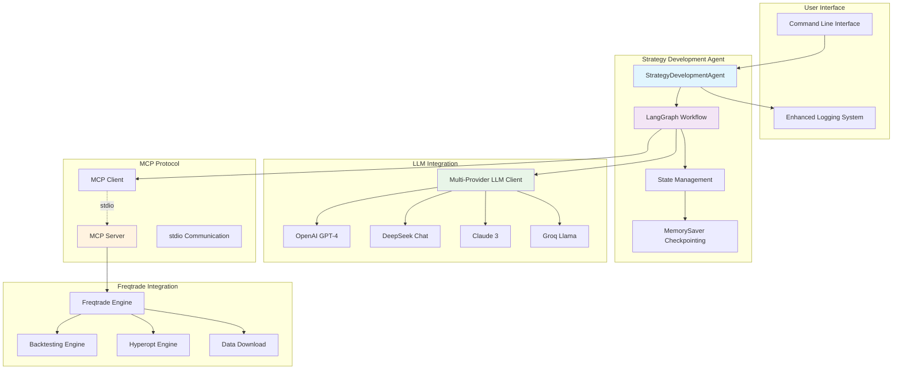
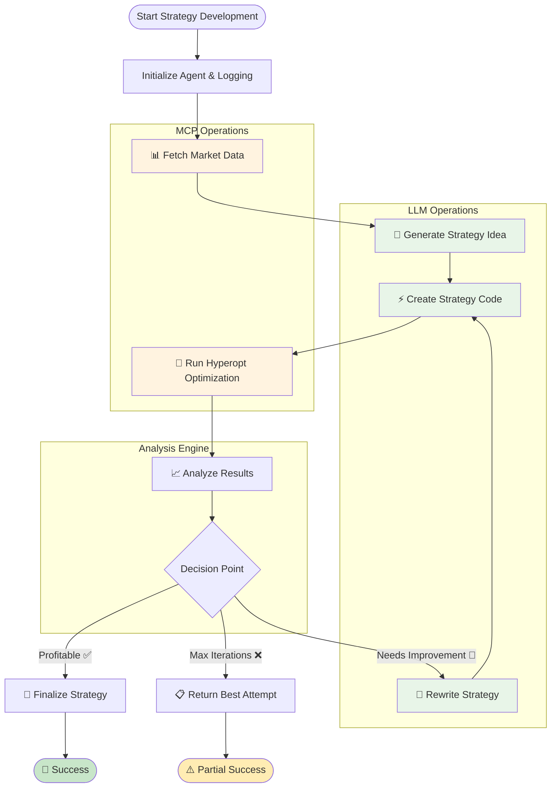
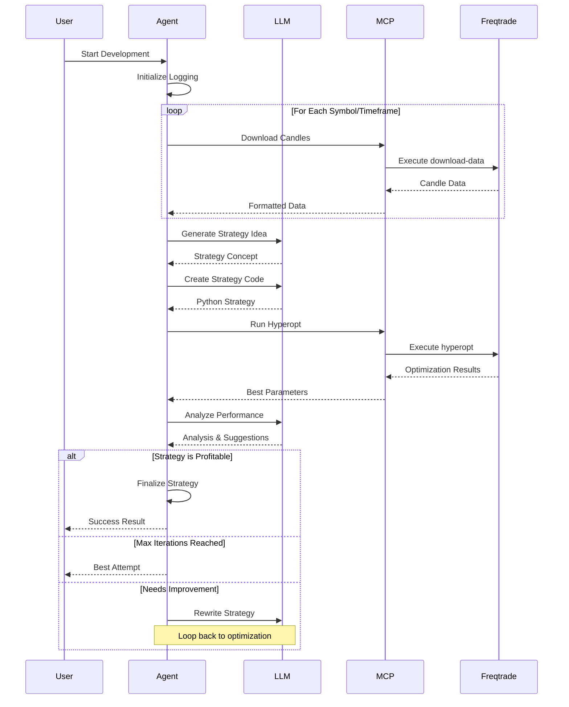
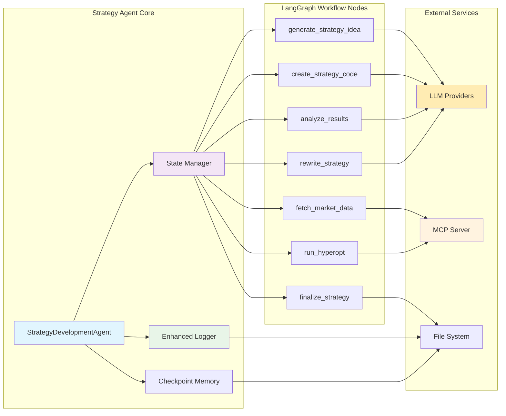
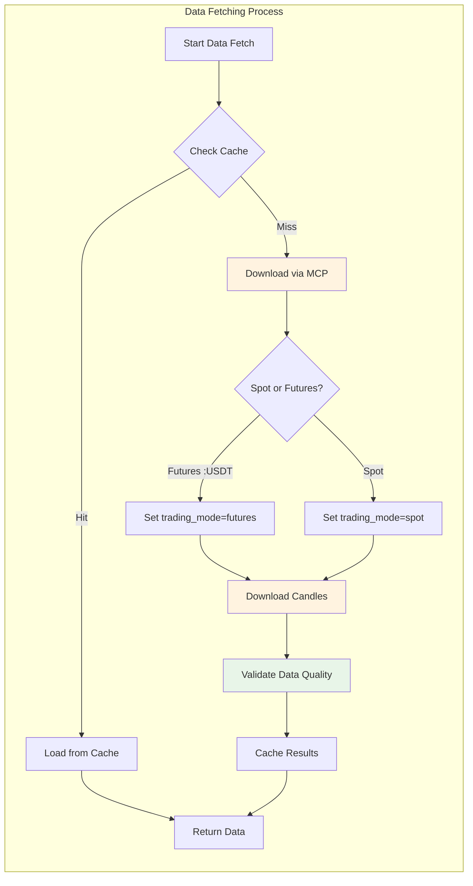
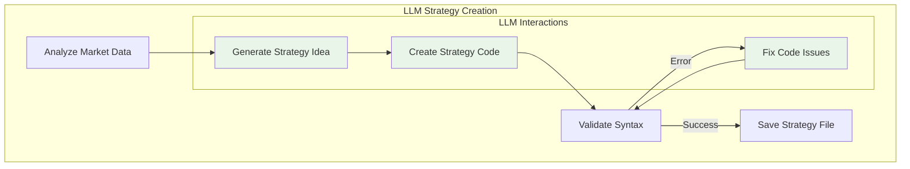
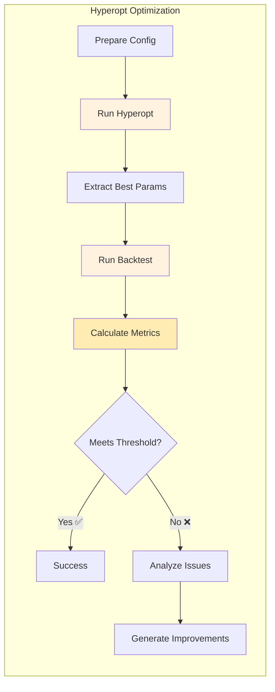
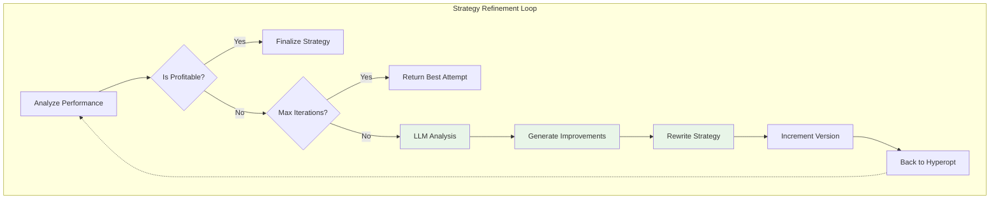
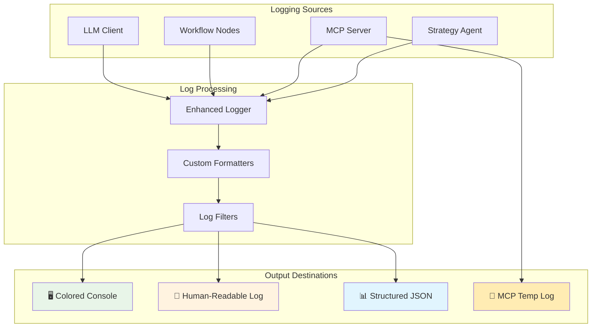

# Freqtrade Strategy Development Agent

## Overview

The **Freqtrade Strategy Development Agent** is an autonomous AI system that creates, optimizes, and validates profitable trading strategies using LangGraph workflow orchestration and multiple LLM providers. It integrates with Freqtrade via the Model Context Protocol (MCP) to perform backtesting and hyperparameter optimization.

## Features

- 🤖 **Autonomous Strategy Generation** - AI-powered strategy creation based on market analysis
- 🔄 **Iterative Improvement** - Automatically refines strategies based on performance
- 📊 **Hyperparameter Optimization** - Uses Freqtrade's hyperopt for parameter tuning
- 📈 **Performance Analysis** - Comprehensive metrics evaluation (Sharpe, profit, drawdown)
- 🔗 **MCP Integration** - Seamless communication with Freqtrade via stdio protocol
- 📝 **Enhanced Logging** - Human-readable and structured JSON logs for debugging
- 🌍 **Multi-Provider LLM Support** - Works with OpenAI, DeepSeek, Anthropic, Groq, etc.

## System Architecture

### High-Level System Overview



### Core Workflow Architecture



### Data Flow Architecture



### Component Interaction Diagram



## Installation

### Prerequisites

```bash
# Python 3.8+
python --version

# Install dependencies
pip install -r requirements.txt

# Required packages:
# - langgraph
# - instructor
# - pydantic
# - mcp
# - python-dotenv
```

### Environment Setup

Create a `.env` file with your LLM configuration:

```bash
# LLM Configuration (choose one provider)

# OpenAI
LLM_MODEL=openai/gpt-4o-mini
LLM_API_KEY=sk-your-openai-key

# DeepSeek (OpenAI-compatible)
LLM_MODEL=deepseek/deepseek-chat
LLM_API_KEY=sk-your-deepseek-key

# Anthropic
LLM_MODEL=anthropic/claude-3-haiku-20240307
LLM_API_KEY=sk-your-anthropic-key

# Groq
LLM_MODEL=groq/llama-3.1-8b-instant
LLM_API_KEY=gsk-your-groq-key

# Optional settings
LLM_TEMPERATURE=0.3
LLM_MAX_TOKENS=4000
```

## Usage

### Basic Usage

```bash
# Run with default settings
python run_strategy_agent.py

# With custom parameters
python run_strategy_agent.py \
  --symbols BTC/USDT:USDT ETH/USDT:USDT \
  --timeframes 1h 4h \
  --max-iterations 3 \
  --hyperopt-epochs 100 \
  --min-profit 5.0 \
  --verbose
```

### Command-Line Options

| Option | Default | Description |
|--------|---------|-------------|
| `--symbols` | BTC/USDT:USDT ETH/USDT:USDT | Trading pairs (use :USDT for futures) |
| `--timeframes` | 1h | Candle timeframes |
| `--max-iterations` | 3 | Maximum strategy rewrites |
| `--hyperopt-epochs` | 100 | Hyperopt optimization epochs |
| `--min-profit` | 5.0 | Minimum profit threshold (%) |
| `--mcp-server-path` | auto-detect | Path to MCP server script |
| `--resume` | None | Resume from checkpoint ID |
| `--verbose` | False | Enable debug logging |

## Detailed Workflow Process

### Phase 1: Data Collection & Preparation



**Key Features:**
- Auto-detects futures pairs (`:USDT`, `:BUSD` suffixes)
- Intelligent caching system (24-hour TTL)
- Data quality validation (null checks, gap detection)
- Supports multiple symbols and timeframes concurrently

### Phase 2: AI Strategy Generation



**Strategy Components:**
- **Idea Generation**: Market analysis → Strategy concept
- **Code Creation**: Concept → Working Freqtrade strategy
- **Hyperopt Integration**: Automatic parameter optimization setup
- **Validation**: Syntax checking and error correction

### Phase 3: Optimization & Analysis



**Optimization Process:**
- **Hyperopt Spaces**: Buy, Sell, ROI, Stoploss parameters
- **Loss Function**: SharpeHyperOptLoss (configurable)
- **Parallel Processing**: Multi-core optimization
- **Result Analysis**: Performance metrics calculation

### Phase 4: Iterative Improvement



**Improvement Cycle:**
- **Performance Analysis**: LLM evaluates metrics and identifies weaknesses
- **Strategy Rewriting**: Incorporates feedback and suggestions
- **Version Control**: Tracks iterations and best attempts
- **Convergence**: Stops at profit threshold or max iterations

## Enhanced Logging System

The agent provides comprehensive logging in multiple formats with real-time progress tracking:

### Logging Architecture



### Log Files Structure

```
logs/
├── strategy_YYYYMMDD_HHMMSS.log     # 📄 Human-readable workflow log
├── strategy_YYYYMMDD_HHMMSS.json    # 📊 Structured JSON log  
└── mcp_server_YYYYMMDD_HHMMSS.log   # 🔧 MCP server operations
```

### Real-Time Console Output

```mermaid
graph LR
    subgraph "Console Log Levels"
        A[🔍 DEBUG] --> B[✅ INFO]
        B --> C[⚠️ WARNING] 
        C --> D[❌ ERROR]
        D --> E[🚨 CRITICAL]
    end
    
    subgraph "Progress Indicators"
        F[📋 PHASE: Data Fetching]
        G[📍 STEP: Download Candles]
        H[⏳ PROGRESS: [2/5] 40%]
        I[📊 METRICS: Profit: 5.2%]
        J[✨ SUCCESS: Strategy Complete]
    end
    
    style A fill:#87ceeb
    style B fill:#90ee90
    style C fill:#ffd700
    style D fill:#ffcccb
    style E fill:#ff69b4
```

### Human-Readable Log Format

```
[2025-01-18 10:30:45] INFO     | PHASE: DATA FETCHING | STEP: Market Data Collection
  Starting to fetch BTC/USDT:USDT 1h data
  DATA:
    - candles: 8760
    - cached: false

[2025-01-18 10:31:00] INFO     | PHASE: STRATEGY GENERATION | STEP: Idea Generation
  ✨ SUCCESS: Strategy idea generated
  DATA:
    - name: MomentumBreakout
    - indicators: ['RSI', 'MACD', 'Volume']
    - timeframe: 1h
```

### Structured JSON Log Format

```json
{
  "timestamp": "2025-01-18T10:30:45",
  "level": "INFO",
  "phase": "DATA FETCHING",
  "step": "Market Data Collection",
  "message": "Starting to fetch BTC/USDT:USDT 1h data",
  "data": {
    "candles": 8760,
    "cached": false
  }
}
```

## Error Handling

The agent includes comprehensive error handling:

1. **LLM Errors** - Automatic retry with exponential backoff
2. **MCP Communication** - Detailed error messages with stdout/stderr
3. **Strategy Failures** - Falls back to best attempt after max iterations
4. **Data Issues** - Validates candle data quality

## Performance Metrics

The agent evaluates strategies using:

- **Total Profit %** - Overall return on investment
- **Sharpe Ratio** - Risk-adjusted returns
- **Max Drawdown %** - Maximum peak-to-trough decline
- **Win Rate %** - Percentage of profitable trades
- **Total Trades** - Number of executed trades
- **Calmar Ratio** - Return vs. max drawdown
- **Sortino Ratio** - Downside risk-adjusted returns

## Troubleshooting

### Common Issues

#### 1. "Model Not Exist" Error
```bash
# Check your LLM_MODEL format
# Correct: provider/model-name
export LLM_MODEL=deepseek/deepseek-chat  # ✓
export LLM_MODEL=deepseek-R1             # ✗

# Test your configuration
python test_llm_simple.py
```

#### 2. MCP Connection Failed
```bash
# Ensure MCP server is running
cd ../src
python -m server

# Or specify path explicitly
python run_strategy_agent.py --mcp-server-path ../src/server.py
```

#### 3. Hyperopt Fails
```bash
# Check logs for detailed error
cat logs/strategy_*.log | grep -A 10 "HYPEROPT"

# Common fixes:
# - Ensure strategy file exists in user_data/strategies/
# - Check for syntax errors in generated strategy
# - Verify trading pairs are available
```

### Debug Tools

```bash
# Test LLM configuration
python test_llm_simple.py

# Test DeepSeek specifically
python test_deepseek.py

# Test full LLM debug suite
python test_llm_debug.py
```

## Advanced Configuration

### Custom Strategy Constraints

Edit `strategy_agent/config.py`:

```python
# Performance thresholds
self.min_sharpe_ratio = 0.5
self.max_drawdown_pct = 20.0
self.min_win_rate_pct = 35.0
self.min_trades = 50

# Hyperopt settings
self.hyperopt_loss_function = "SharpeHyperOptLoss"
self.hyperopt_spaces = ["buy", "sell", "roi", "stoploss"]
```

### Memory and Checkpointing

The agent uses LangGraph's MemorySaver for checkpointing:

```python
# Resume from checkpoint
python run_strategy_agent.py --resume checkpoint_id

# List available checkpoints
agent = StrategyDevelopmentAgent()
checkpoints = await agent.get_checkpoints()
```

## API Reference

### StrategyDevelopmentAgent

```python
from strategy_agent import StrategyDevelopmentAgent

agent = StrategyDevelopmentAgent(
    symbols=["BTC/USDT:USDT"],
    timeframes=["1h"],
    max_iterations=3,
    hyperopt_epochs=100,
    min_profit_threshold=5.0,
    mcp_server_path="path/to/server.py"
)

# Run strategy development
result = await agent.develop_strategy()

# Result structure
{
    "success": bool,
    "strategy_name": str,
    "strategy_file": str,
    "metrics": {
        "total_profit": float,
        "sharpe_ratio": float,
        "max_drawdown": float,
        "win_rate": float,
        "total_trades": int
    },
    "hyperopt_params": dict,
    "duration_minutes": float,
    "session_id": str
}
```

## Contributing

Contributions are welcome! Please:

1. Follow the SOLID principles
2. Add comprehensive logging
3. Include error handling
4. Write tests for new features
5. Update documentation

## License

This project is part of the Freqtrade ecosystem. See LICENSE file for details.

## Support

- GitHub Issues: Report bugs and request features
- Documentation: See additional `.md` files in the repository
- Freqtrade Community: Join the discussion on Discord

---

**Note**: This agent generates trading strategies for educational and research purposes. Always test strategies thoroughly before using with real funds. Past performance does not guarantee future results.